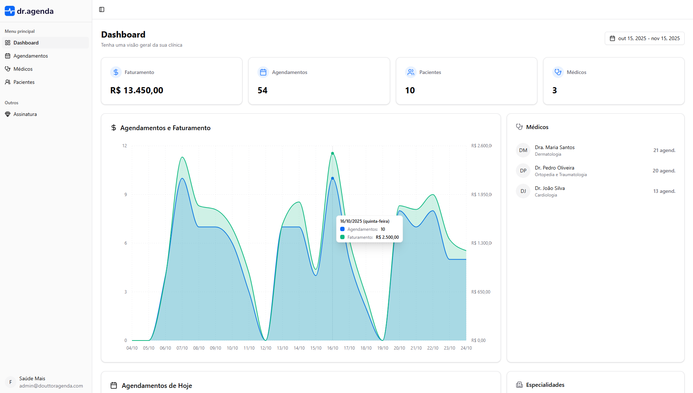
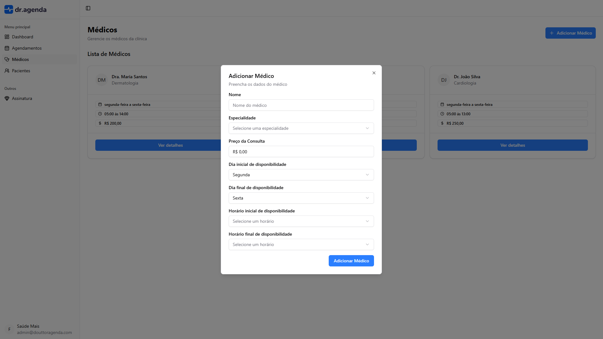
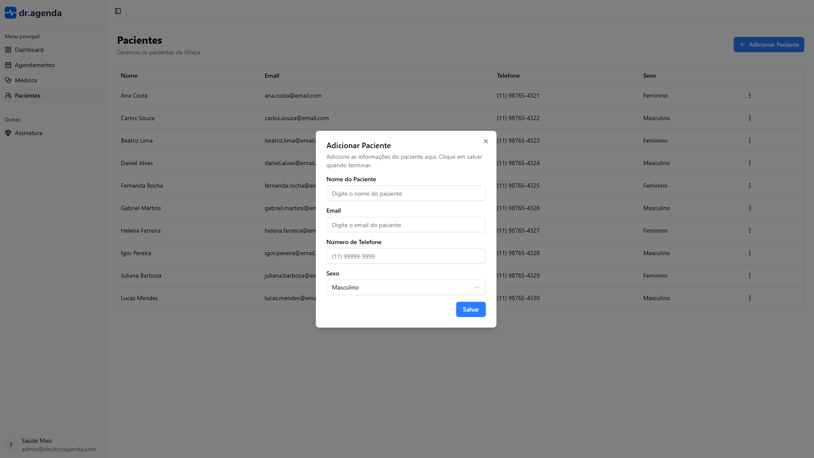
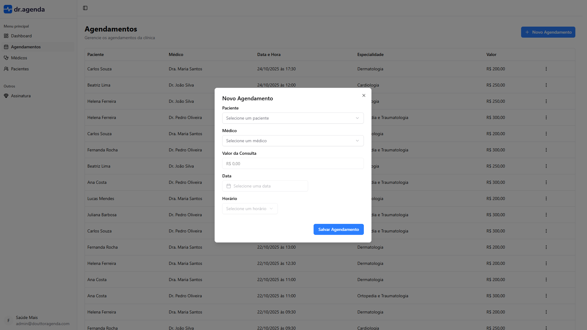

# 🏥 Doutor Agenda

<div align="center">


**Sistema completo de agendamento e gestão de clínicas médicas**


[](https://www.typescriptlang.org/)
[](https://tailwindcss.com/)
[](https://orm.drizzle.team/)

</div>

---

## 📋 Sobre o Projeto

O **Doutor Agenda** é uma plataforma SaaS completa para gestão de clínicas médicas, oferecendo controle total sobre agendamentos, médicos, pacientes e faturamento. Desenvolvido com as tecnologias mais modernas do ecossistema Next.js 15 com App Router e TypeScript.

### 🎯 Principais Diferenciais

- 🏥 **Gestão Completa**: Médicos, pacientes e agendamentos em um só lugar
- 💰 **Sistema de Assinatura**: Modelo plano mensal com integração Stripe
- 📅 **Agendamento Inteligente**: Verificação automática de disponibilidade
- 📊 **Dashboard Analítico**: Métricas e gráficos em tempo real
- 🔒 **Autenticação Robusta**: Better Auth com suporte a OAuth (Google)
- 🎨 **UI/UX Moderna**: Design system consistente com shadcn/ui
- 🛡️ **Type Safety**: 100% TypeScript com validação Zod

---

## ✨ Funcionalidades

### 👨‍⚕️ Gestão de Médicos

- CRUD completo com perfil detalhado (nome, especialidade, foto, preço)
- Configuração de disponibilidade (dias e horários de atendimento)
- Validações inteligentes para prevenção de conflitos

### 👥 Gestão de Pacientes

- Cadastro completo (nome, email, telefone, sexo)
- Histórico de consultas e agendamentos
- Validação de duplicatas por clínica

### 📅 Sistema de Agendamentos

- Verificação automática de disponibilidade médica
- Calendário interativo para seleção de datas
- Gestão de horários com controle preciso de slots
- Preços dinâmicos vinculados ao médico

### 📊 Dashboard Analítico

- Métricas em tempo real (médicos, pacientes, consultas)
- Análise de faturamento por período
- Gráficos interativos com Recharts
- Lista de próximas consultas agendadas

---

## 🏗️ Tecnologias

### Frontend

- **Framework**: Next.js 15 (App Router + Turbopack)
- **Linguagem**: TypeScript
- **Estilização**: Tailwind CSS 4 + shadcn/ui
- **Componentes**: Radix UI primitives
- **Formulários**: React Hook Form + Zod
- **Tabelas**: TanStack Table v8
- **Gráficos**: Recharts
- **Notificações**: Sonner

### Backend

- **Runtime**: Node.js
- **API**: Next.js Server Actions + API Routes
- **Validação**: Zod schemas + next-safe-action
- **ORM**: Drizzle ORM
- **Banco**: PostgreSQL

### Integrações

- **Autenticação**: Better Auth (Google OAuth)
- **Pagamentos**: Stripe
- **Deploy**: Vercel

---

## 🚀 Instalação

### Pré-requisitos

- Node.js 18+
- PostgreSQL
- Contas: Google Cloud, Stripe

### Passos

```bash
# 1. Clone o repositório
git clone https://github.com/Abimael-Pereira/doutor-agenda.git
cd doutor-agenda

# 2. Instale dependências
npm install

# 3. Configure variáveis de ambiente
cp env.example .env

# 4. Configure o banco
npx drizzle-kit push
npm run db:seed  # opcional

# 5. Execute
npm run dev
```

Acesse [http://localhost:3000](http://localhost:3000)

---

## 📁 Estrutura do Projeto

```
doutor-agenda/
├── src/
│   ├── actions/              # Server Actions
│   ├── app/
│   │   ├── (protected)/      # Rotas autenticadas
│   │   │   ├── dashboard/
│   │   │   ├── doctors/
│   │   │   ├── patients/
│   │   │   └── appointments/
│   │   ├── api/              # Better Auth + Stripe
│   │   └── authentication/
│   ├── components/ui/        # shadcn/ui
│   ├── db/                   # Drizzle schema
│   └── lib/                  # Configs
```

---

## 🎨 Screenshots

<div align="center">

### Dashboard Principal



### Gestão de Médicos



### Gestão de Pacientes



### Agendamentos



</div>

---

## ❓ FAQ

<details>
<summary><strong>Como obter as chaves das APIs?</strong></summary>

- **Google OAuth**: [Google Cloud Console](https://console.cloud.google.com) - Crie um projeto e configure OAuth 2.0
- **Stripe**: [stripe.com](https://stripe.com) - Acesse o dashboard e pegue as chaves de API

</details>

<details>
<summary><strong>O projeto funciona sem o Stripe?</strong></summary>

Não! Nesse caso é necessário adicionar o plano essential manualmente no usuário pelo banco de dados.

</details>

---

## 👨‍💻 Autor

**Abimael Pereira**

- GitHub: [@Abimael-Pereira](https://github.com/Abimael-Pereira)
- LinkedIn: [Abimael Pereira](https://linkedin.com/in/abimaelpereira)

---


<div align="center">

**Desenvolvido com ❤️ e ☕ por [Abimael Pereira](https://github.com/Abimael-Pereira)**

⭐ Se este projeto foi útil, considere dar uma estrela!

[](https://github.com/Abimael-Pereira/doutor-agenda)

</div>
